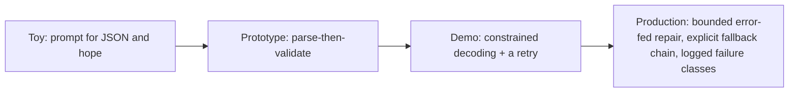

## Reviewing a structured-output design

**In brief.** Every structured-output design is an answer to one question: where on the prevent →
validate → repair → fall back pipeline do you spend effort, and how much correctness does it buy per
dollar of latency and tokens? Reviewing one means walking five levers and refusing to let any single
layer stand in for the whole stack.

**The five levers.**

- **Prevention** — constrained decoding, provider JSON mode, GBNF grammars. Buys syntax and shape by construction and kills malformed output. Costs decoder overhead and a quality drift under aggressive constraints, and it needs decoder or provider support.
- **The contract** — the schema as the single authority (Zod, Pydantic, Ajv): validates at runtime and yields a static type for free. The lever is **strictness**; more required fields and tighter types catch more but also fail more, raising the repair rate.
- **Recovery** — the bounded, error-fed repair loop: the model gets its own invalid output plus the concrete validation error. The lever is the **bound** — `N` attempts, a token budget, a wall-clock cap.
- **Graceful degradation** — the fallback chain: simpler schema → deterministic default → human review. The lever is how far down you will degrade and still call the response valid.
- **Observability** — logging and classifying failures by class (malformed, missing field, wrong type, enum violation, truncation). Without it you cannot tell whether to invest in prevention or repair; you are tuning blind.

**The review checklist.**

- **How is the output consumed?** The only acceptable answer is parse-then-validate against an explicit schema. Regex-scraping fields out of raw text is an immediate flag: it fails silently and wrongly instead of loudly and precisely, and it cannot tell a syntax failure from a semantic one. Caching the regexes or switching output format does not touch the silent-wrongness.
- **Is there a contract, and is the schema the authority?** No schema — or a schema that repair is allowed to second-guess — means there is no real contract.
- **Is prevention used, and do they still validate on top of it?** Constrained decoding is good, but "we use JSON mode so we skip validation" is the classic shape-vs-meaning error. Masking guarantees well-formed, schema-shaped JSON; it says nothing about whether the enum value, the number range, or a business rule is legal. Prevention and validation are complementary, not substitutes.
- **Is repair bounded and error-fed?** No cap on attempts, latency, or cost is a `while(true)` waiting to happen — some outputs are simply unrepairable, so an unbounded loop makes p99 latency and the bill unbounded. Feeding the concrete error back is what makes repair work and should stay; a retry without it is a blind retry.
- **What happens when repair is exhausted?** A real design names its fallback chain so the caller always gets something valid — never a crash, never a silently-wrong result — and logs failure classes so the team can see where to invest.

**The antipatterns to name.**

- **Regex-scraping** fields out of the raw text, and **`eval`-ing** the model string.
- **"The model usually returns valid JSON"** — a 1% malformed rate is invisible in ten demo calls and is roughly 1,000 broken responses per 100k requests. The tail does not disappear at scale; engineering that tail is the whole job.
- **Unbounded repair** with no cap on attempts, latency, or cost.
- **Constrained decoding as a licence to skip validation.**

**Why it matters.** These five checks place any design on the toy → prototype → demo-ready →
production-ready ladder in minutes: a toy prompts for JSON and hopes, a prototype parses-then-validates,
a demo adds constrained decoding and a retry, and only a production-ready design also bounds and
error-feeds repair, names an explicit fallback chain, and logs failure classes so the pipeline can be
tuned against real traffic.
