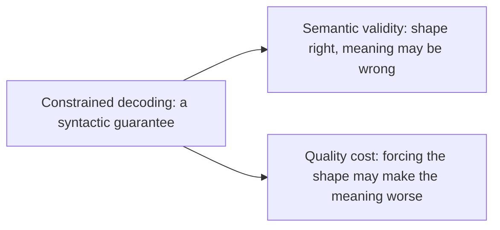

## The frontier & operating the pipeline

**In brief.** The research edge and the production dashboard press on the same seam: constrained
decoding is a **syntactic** guarantee. Knowing exactly what masking provably cannot buy, and which
signals to watch once the pipeline is live, is what separates someone who knows structured output from
someone who runs it.

**Where the frontier is.**

- **How masking works** — the schema or grammar is compiled into a finite-state machine and the logits are masked at every step, so only tokens that keep the output valid can be sampled. Outlines (Willard & Louf, 2023) formalized finite-state constrained decoding; llama.cpp **GBNF** grammars expose the same idea as a concrete knob; provider JSON mode is the productized form. Validity becomes a property of **decoding**, not a post-hoc check, so syntax failures are eliminated by construction.
- **Semantic validity** — the central open problem. A grammar guarantees a well-formed shape (the braces balance, the field is a string, the enum slot holds one of the allowed literals) but says nothing about whether values satisfy **business rules**: a date in range, an ID that actually exists, two fields that must agree. A grammar cannot express "this order total equals the sum of its line items." That is why a schema-validation layer still sits on top, and why constrained decoding buys form while semantic validity is the part it provably cannot buy.
- **The quality cost of aggressive constraints** — heavy masking does not just filter tokens, it **steers the token distribution** away from what the model would otherwise have sampled, so forcing output onto a rigid grammar can degrade the content of the answer even while it parses. The discipline is **eval-gated adoption**: measure the quality cost against a task metric, not just the parse rate. A team reporting "100% valid JSON" as a pure win is treating a green parse rate as a correct answer — the constraint moved cost, it did not erase it.
- **Why the two pair up** — both flow from the same fact that masking guarantees form, not meaning, and they attack that seam from opposite sides. Semantic validity is "the shape is right but the meaning may be wrong"; the quality cost is "forcing the shape may make the meaning worse."

**Signals to watch in production.**

- **Schema-validation failure rate** — the headline gauge: the fraction of outputs that parse but fail the schema. Watch it as a rate, not an anecdote. Crucially, break it down **by failure class** — malformed vs. missing-field vs. wrong-type vs. enum vs. truncation — because the dominant class is what routes the decision: malformed dominating points at **prevention** (constrained decoding), while missing-field and enum violations point at the **schema and repair loop**. The aggregate rate alone cannot make that call.
- **Repair-attempt rate** — how often a request enters the bounded, error-fed repair loop and how many attempts it takes. A rising rate is the leading indicator that an earlier layer — the prompt, schema strictness, or the decoder — is drifting. Because tightening the schema raises this rate by design, read it together with strictness, never in isolation.
- **Fallback rate** — how often repair is exhausted and the request degrades down the chain. This is the "automated path failed" signal. The chain is a **cost gradient** (repair cheapest, human most expensive), so a rising share of traffic reaching the **human** step means an earlier, cheaper layer is slipping. The queue is a symptom: strengthen the earlier layer rather than hiring more reviewers.
- **Latency overhead of constrained decoding** — masking removes syntax-failure repairs but adds per-token decoder overhead. The win is real only if the saved repair calls, with their latency and tokens, outweigh the added decode overhead and any measured quality cost.

**Why it matters.** Alert on repair-attempt rate and fallback rate as the leading indicators that the
contract is slipping, capacity-plan on the schema-validation failure rate **broken down by class**, and
never reason about reliability from "the model usually returns valid JSON" — the real currency is the
tail failure rate, and engineering that tail is the whole job.
